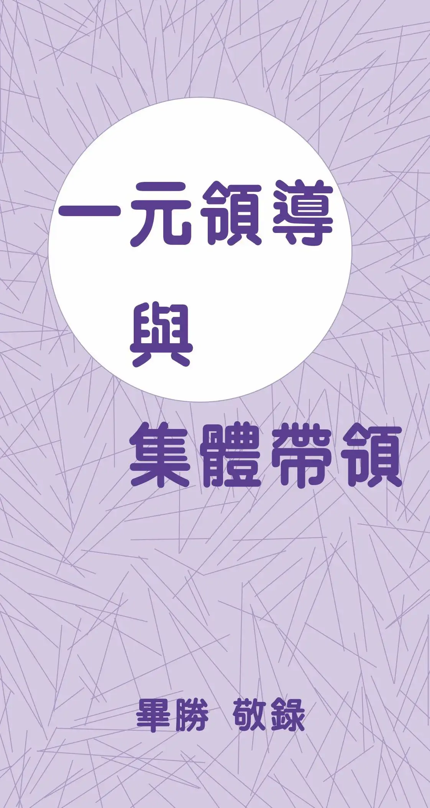

# 一元領導與集體帶領
{ width="100" }
畢勝. (2003). *一元領導與集體帶領*.

**一元領導與集體帶領** 1

1. 什麼是一元領導? 1
1. 什麼是集體帶領? 3
1. 伊甸園集體帶領的惡例 4
1. 集體領導與大痲瘋 6
1. 集體帶領與活活墜落陰間  10

**一元領導與時代器皿** 15

1. 跟從人與跟從時代器皿 15
1. 從舊約的時代器皿看一元領導 19
1. 從新約時代的使徒看一元領導 23
1. 從新約教會的重建看一元領導 28
