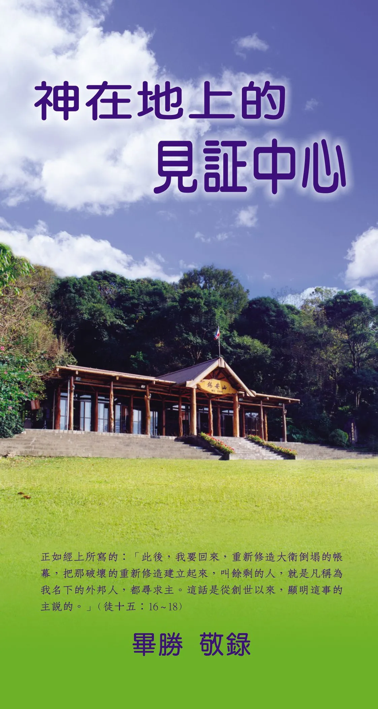

# 神在地上的見證中心
{ width="100" }
畢勝. (1977). *神在地上的見證中心*

**前 言** 1

**一、教會的超越性** 1

**二、教會的正統性** 3

**三、舊約時代神在地上的見證中心** 7

1. 舊約教會的起源 7
1. 神立名的所在 8
1. 時代器皿 9

**四、舊約時代非正統（非啟示）的敬拜事奉** 11

1. 兩條不同的線 11
1. 耶羅波安干犯神的行政 11
1. 烏撒干犯神的行政 16
1. 拿答、亞比戶干犯神的行政 17

**五、新約時代神在地上的見證中心** 19

1. 新約教會的起源 19
1. 初期教會見證的失落 20
1. 新約教會的重建 21

**六、公會宗派偏離了見證中心** 24
