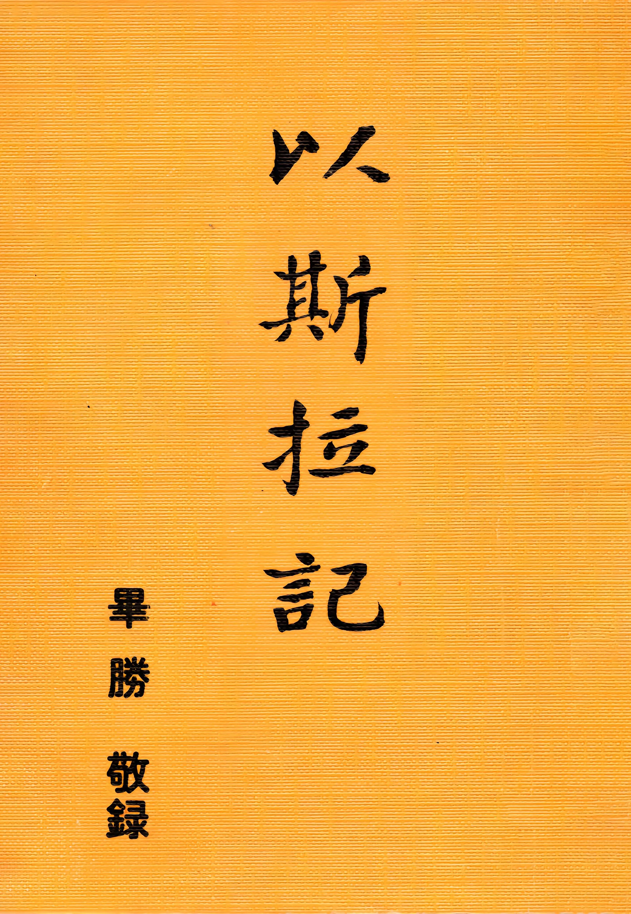

# 以斯拉記
{ width="100" }
畢勝. (1980). *以斯拉記*.

**序　　言** 1

**以斯拉記第一章──古列王元年下詔建殿** 1

1. 寶座的出口 3
1. 寶座的行動 7
    1. 激動古列王的心 8
    1. 激動猶大、便雅憫的族長，和祭司利未人 10
    1. 激動四圍的人甘心獻上禮物 11
    1. 今日寶座行動──重建新約教會 12
1. 寶座的心聲 15
1. 響應寶座的呼召 28
1. 寶座所要的器皿 33

**以斯拉記第二章──被擄的歸回** 38

1. 被擄的歸回成了大幫 38
1. 被擄回來的人各歸本城 40
1. 神將一切的福都賜給歸回的人 41
1. 祭司和利未人的歸回與煉淨 56
1. 歸回者的道路是一條全然獻上的道路 60

**以斯拉記第三章──復築祭壇，重建聖殿** 65

1. 以色列百姓聚集在耶路撒冷如同一人 65
1. 在原有的根基上築壇，
    * 照著神人摩西律法書上寫的獻燔祭 71
1. 招收工人及預備重建聖殿材料 79
1. 建聖殿，立定根基 81

**以斯拉記第四章──重建聖殿工程被迫停工** 90

1. 仇敵多方謀阻建殿工程 90
1. 仇敵控告猶大和耶路撒冷的居民 95
1. 耶路撒冷聖殿重建被迫停工 99

**以斯拉記第五章──再興重建聖殿工程** 106

1. 停工期間猶大的荒涼光景 106
1. 奉以色列神的名再興建殿 108
1. 達乃和同黨也上本奏告大利烏王 112
1. 達乃的奏本中為神的殿作見證 113

**以斯拉記第六章──聖殿重建竣工與行獻殿之禮** 120

1. 尋查典籍庫內得先王古列詔書 120
1. 大利烏王命令補滿了先王古列之詔 127
1. 聖殿重建完工 131
1. 行獻殿之禮 139
1. 歸回後第一次過逾越節 142