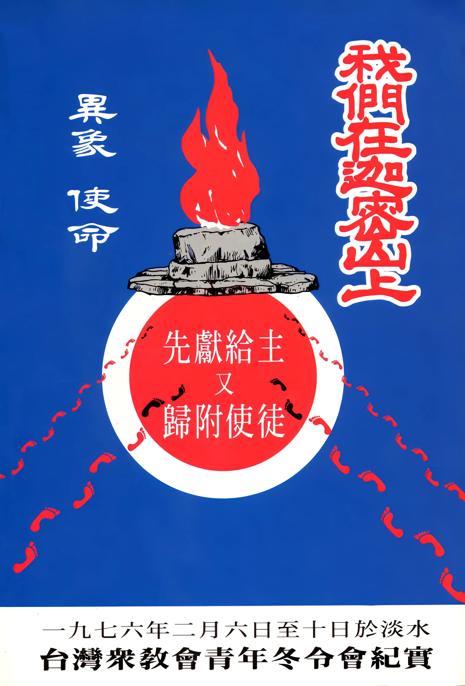

# 我們在迦密山上
{ width="100" }
基督靈恩佈道團. (2000). *我們在迦密山上*.

**台灣眾教會一九七六年冬令會實況報導** 1

* 前　　言 1
* 旗開得勝，聖靈動了善工 2
* 復興的事工與復興的器皿3
* 幫助聖徒領受聖靈 4.
* 七六‧二‧九，畢生難忘！ 5
* 神呼召復興器皿 5
* 神賜憂傷痛悔的靈 6
* 眾人同上祭壇 9
* 求恩賜，必得著 10
* 聖靈澆灌再達高峰 11
* 最後高潮──迦密山上獻祭 11
* 盛況空前的見證會 12

**信 息** 16

* 復興的異象──末世教會合一見證的恢復 (洪以利亞弟兄) 16
* 復興的器皿 (洪以利亞弟兄) 28
* 怎樣進神國 (畢 勝弟兄) 36
* 見神國與進神國 (畢 勝弟兄) 49
* 神對祂國度的永遠計劃與終極目的 (畢 勝弟兄) 60
