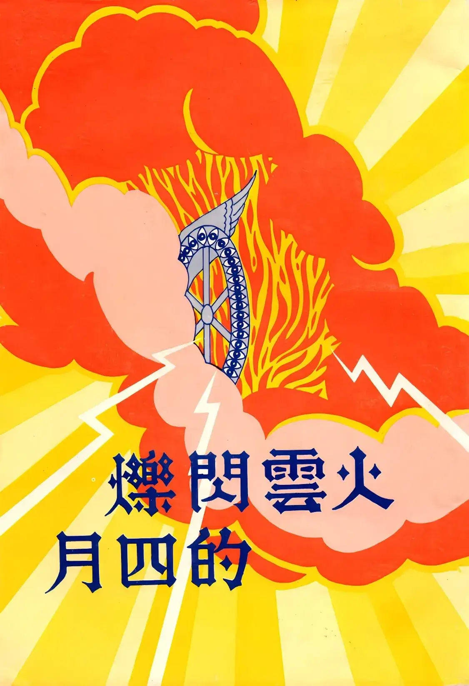

# 火雲閃爍的四月
{ width="100" }
基督靈恩佈道團. (1977). *火雲閃爍的四月*.

**代  序** 1

**火雲閃爍的四月** 1

1. 光輝燦爛的四月三日 2
    1. 傾覆背道巢穴，重新豎立大旗 2
    1. 主在吉隆坡潔淨祂的殿，揚淨祂的場 2
    1. 從巴比倫歸回，重建神的家 3
    1. 耶和華見所羅巴伯手拿線鉈（[*生命證道集*](../江端儀敬錄書籍/生命證道集.md)）就歡喜 4
    1. 復興靈工原是從台南開始，靈火再燒回古城 5
    1. 我們在東方眾海島榮耀耶和華以色列神的名，在地極就有人歌唱，願榮耀歸與義人 6
    1. 這殿末後的榮耀必大過先前的榮耀 6
1. 四月六日被擄的得釋放 6
    1. 被擄於背道者的得以歸回 7
    1. 被仇敵撒但壓制的得以釋放 7
1. 四月星馬特會在檳城， 攻取迦南全地為業 9
    1. 我（主耶穌）來要把火丟在地上（路十二：49） 9
    1. 靈火從檳城燒到了天定 9
    1. 馬來西亞的吉甲──吉隆坡 10
1. 四月復興靈火越燒越光芒 11
    1. 在這乾旱世代，宗派正像破漏不能存水的池子 11
    1. 得人如得魚，叫萬民流歸耶和華殿的山 12
    1. 神必要從宗派公會收回一切的恩賜和同在， 全然賜給合乎祂心意的新約教會 13
1. 三個（奇蹟）的四月十八日 16
    1. 宗派眾弟兄在真道上同歸於一 16
    1. 擴張帳幕，拆毀中間隔斷的牆 18
    1. 末世晚雨靈恩沛然下降，解除全地乾渴 19
1. 悲痛的回憶，榮耀的展望 20
1. 火雲閃爍的四月在婆羅洲 21
    1. 聖靈在沐膠的三江中學 21
    1. 復興的四月在詩巫 22
    1. 傳遞復興靈火到古晉 22

**公開信** 24

* 遵守我忍耐的道 24

**特會報導** 26

* 整體合一的見証與建造 26
    1. 籌備報到 27
    1. 看哪！這是整體合一的見証 28
    1. 榮耀的盛會 30
* 特會補記 35
* 榮耀特會中更深的學習與經歷 39
    1. 整體爭戰禱告的力量 39
    1. 運用恩賜與生命，真理的平衡 40
    1. 糾正真理認識上領會的偏差 40
    1. 肢體配搭事奉的重要性 41

**禧年佳音** 42

**蒙恩見證** 50

* 復興水流湧到天定 席捲婆羅洲 77
