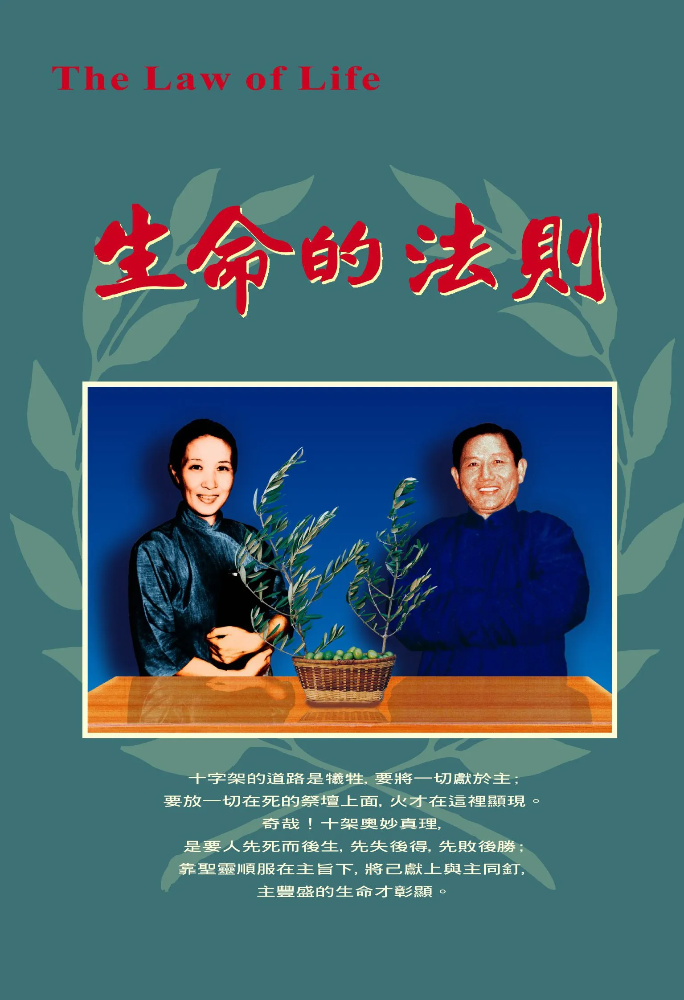

# 生命的法則
{ width="100" }
基督靈恩佈道團. (2003). *生命的法則*

**序　言** 1

**兒子的靈與生命的學習** 1

**照顧羊群的原則──與使徒同心** 13

**服在神的權下** 25

**一根刺** 38

**有擔當的器皿** 49

**信心的根據** 63

**不畏艱難、挑戰艱難** 74

**用異象克服環境** 82

**防備的靈** 85

**生命的學習** 88

**讚美的事奉** 92
