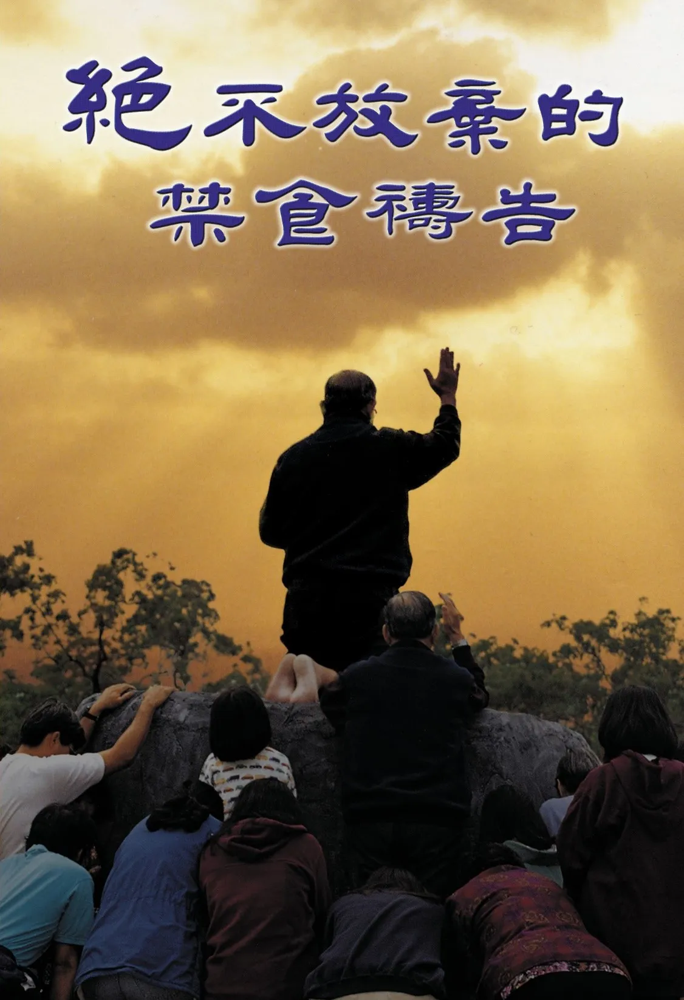

# 絕不放棄的禁食禱告
{ width="100" }
基督靈恩佈道團. (2004). *絕不放棄的禁食禱告*.

**序 言** 1

**信 息** 1

* 邁向巔峰 1
* 竭力奔跑　絕不放棄 7
* 神施恩的手段──患難 19
* 面對挫折的態度 30

**報導與見証** 41

* 錫安山 42
* 左鎮教會 96
* 高屏眾教會 101
* 台南教會 107
* 新營教會 109
* 嘉義教會 111
* 虎尾教會 116
* 台中、彰化教會 118
* 新竹、花園、楊梅教會 127
* 桃園、中壢教會 132
* 台北教會 135
* 景美教會 140
* 中和教會 144
* 三重、石牌教會 148
* 基隆教會 155
* 花蓮教會 159
* 台東教會 161
* 迦密山 162
* 伯特利 178
* 摩利亞山 181
* 美里教會 185
* 新天新地、伯利恆 186
* 希伯崙 190
* 雙溪大年教會 194
* 亞羅士打教會 195
* 檳城教會 196
* 吉隆玻教會 197
* 永平教會 200
* 居鑾教會 203
* 欣山教會 204
* 新加坡教會 207
* 香港教會 213
* 日本東京教會 216
* 黑門山 218
* 維特班教會 231
* 英國倫敦教會 237
* 德國布萊梅港教會 238
* 橄欖山 240
* 洛杉磯教會 249
* 三藩市教會 259
* 達拉斯 262
* 巴爾的摩教會 263
* 紐約教會 266
* 多倫多教會 267
* 溫哥華教會 269
* U-N-N-S 272
* 布里斯本教會 277
* 墨爾本教會 279
* 亞拉臘山 280
* 基督城教會 283
* 他泊山 286
* 伊甸島 295
* 他哈教會 297
* 諾魯教會 299
