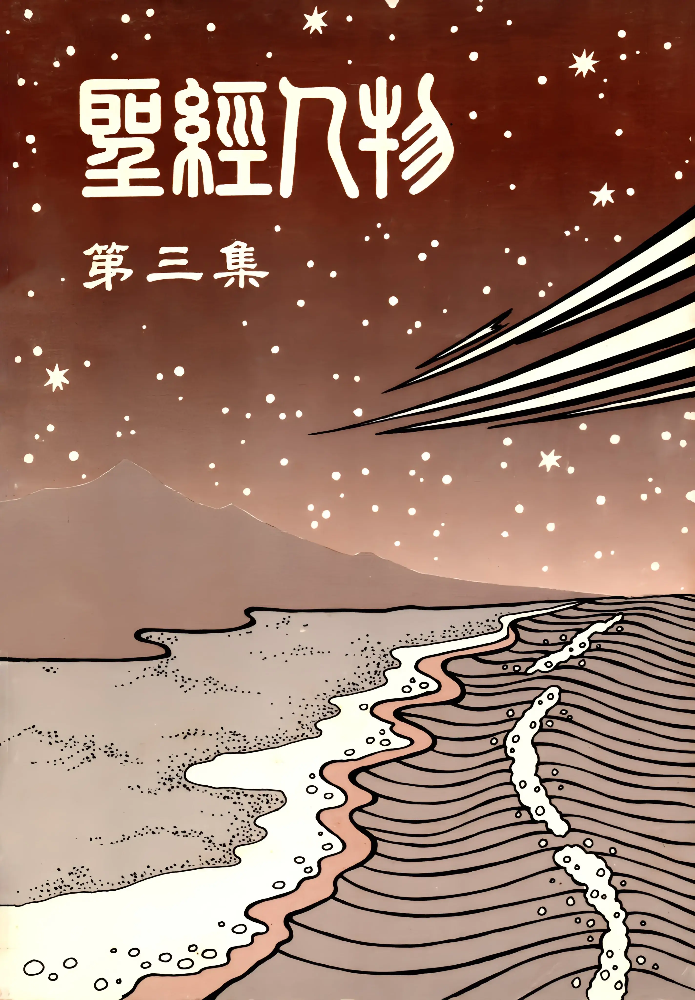

# 聖經人物（三）
{ width="100" }
基督靈恩佈道團. (1991). *聖經人物（三）*.

**以太（一）** 1

**以太（二）** 7

**以太（三）** 14

**掃羅（一）** 21

**掃羅（二）** 32

**掃羅（三）** 41

**押沙龍（一）** 48

**押沙龍（二）** 53

**押沙龍（三）** 59

**米甲（一）** 67

**米甲（二）** 72

**米甲（三）** 78

**米非波設（一）** 83

**米非波設（二）** 94

**米非波設（三）** 102

**亞瑪撒（一）** 109

**亞瑪撒（二）** 115

**亞瑪撒（三）** 124

**撒督（一）** 130

**撒督（二）** 136

**撒督（三）** 145

**戶篩（一）** 151

**戶篩（二）** 156

**戶篩（三）** 165

**亞希多弗（一）** 170

**亞希多弗（二）** 175

**亞希多弗（三）** 183
