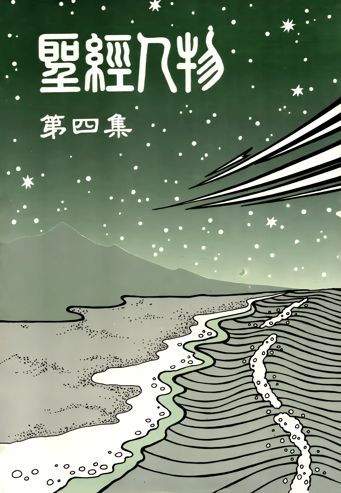

# 聖經人物（四）
{ width="100" }
基督靈恩佈道團. (1991). *聖經人物（四）*.

**施洗約翰（一）** 1

**施洗約翰（二）** 6

**施洗約翰（三）** 14

**西面（一）** 21

**西面（二）** 25

**西面（三）** 34

**尼哥底母（一）** 42

**尼哥底母（二）** 46

**尼哥底母（三）** 54

**拿但業（一）** 58

**拿但業（二）** 64

**拿但業（三）** 72

**腓力、腓利（一）** 76

**腓力、腓利（二）** 85

**非比（一）** 89

**非比（二）** 91

**撒該（一）** 96

**撒該（二）** 101

**撒該（三）** 108

**馬大（一）** 114

**馬大（二）** 118

**馬大（三）** 125

**馬利亞（一）** 130

**馬利亞（二）** 134

**拉撒路（一）** 142

**拉撒路（二）** 148

**抹大拉的馬利亞（一）** 154

**抹大拉的馬利亞（二）** 160
