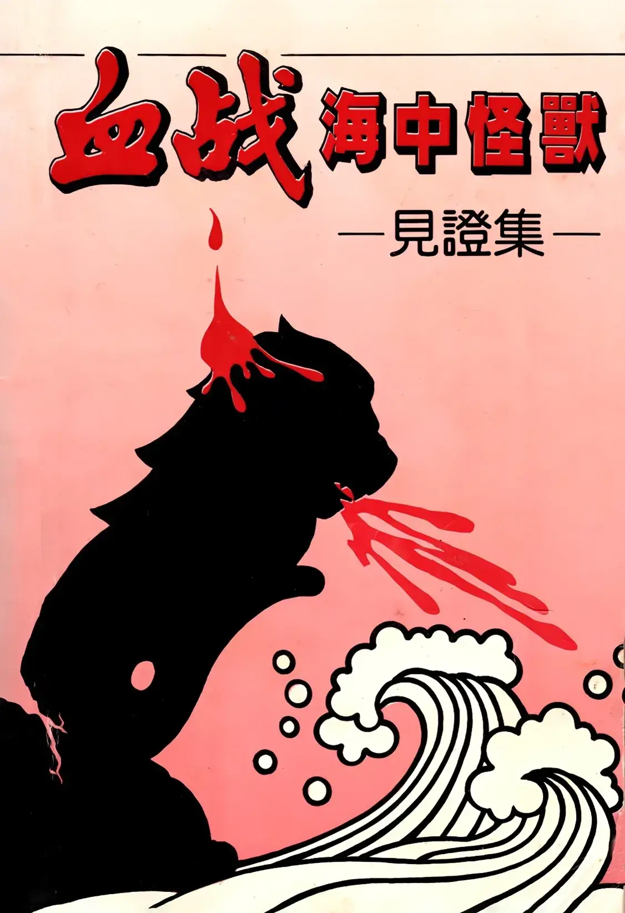

# 血戰海中怪獸
{ width="100" }
基督靈恩佈道團. (1993). *血戰海中怪獸*.

**序 言** 1

**第一批見証人** 1

* 星警是無靈性的畜類 余月心姊妹 1
* 誰能使我們與基督的為隔絕昵 王碧群姊妹 8
* 我們為福音受捆鎖 俞珠俤姊妹 15
* 審判暴君李光耀 吳娥媚姊妹 17
* 李光耀甘作蔣經國的走狗 李偉英姊妹 20
* 我親眼看見了神、經歷了神 黃麗芳姊妹 28
* 靠著禱告勝過新加坡黑牢 李素珍姊妹 44
* 新加坡的警察比魔鬼更恐怖 王淑貞姊妹 46
* 無論是生是死總叫基督在我身上照常顯大 鄭玉英姊妹 49
* 今日羅馬鬥獸場──新加坡 謝則英姊妹 56
* 討伐暴君李光耀 林美蓮姊妹 61
* 見官高一級、見王高一級 方麗明姊妹 65
* 為主打了美好的仗 李淑梅姊妹 69
* 經過試煉成為精金 鄭再錦姊妹 71
* 撇棄一切跟從主 陳強獅弟兄 76
* 為真理為戰、為正義坐監 來  福弟兄 77
* 我把自己擺在死的祭壇上 詹亨豪弟兄 80

**第二批見証人** 82

* 我是錫安子民在星飽受患難磨煉 何慶盛弟兄 82
* 性變態的星警無恥至極 黃大衛弟兄 109
* 神使我們討李伐暴終獲勝 吉米弟兄 117
* 我實際經歷了信心見証人的道路 王紹強弟兄 120
* 李光耀暴政把我折磨得九死一生 陳振富弟兄 124
* 為主坐監是我所不配的 黃東陞弟兄 134
* 在星島黑牢中將自己當作活祭獻給主 黃碧英姊妹 140

**第三批見証人** 144

* 血債必要血還、血仇必要血報 陳月玲姊妹 144
* 暴君李光耀殺了我的孩子 黃玫淵姊妹 149
* 李光耀必亡身、世家、亡黨、亡朝 黃貞敏姊妹 153
* 我為耶穌基督成了帶鎖鍊的使者 黃貞仁姊妹 158
* 不肯苟且得釋放 劉容嬌姊妹 160
* 我們的歌要殺死暴君李光耀 鄭亞妹姊妹 164
* 經歷患難、獻上活祭 林玉清姊妹 169
* 親愛的主納了我的獻上 劉金鈴姊妹 172
* 打倒了卻不至死亡 劉清容姊妹 175
* 暴君必滅、暴政必亡 劉飛仙姊妹 178
* 新加坡警察下流無比 黃麗妃姊妹 180
* 神必叫李家王朝拿命來賠 許麗華姊妹 183
* 不向邪惡、暴力屈服 邱秀玲姊妹 185
* 當庭打開聖經用神的話審判李光耀政權 高秀園姊妹 189

**第四批見証人** 196

* 不為強權暴政所屈服的今日末底改 末底改弟兄 196
* 真理絕不妥協、正義絕不讓步 劉倫福弟兄 202
* 海中怪獸──李光耀必被神除滅 梁永強弟兄 204
* 他們對我嚴刑拷打逼供 蕭錦友弟兄 218
* 忍受嚴刑不肯出賣第兄姊妹 張仕芳姊妹 221
* 真理正義戰勝李家王朝 林雅玲姊妹 223
* 神必追討李家王朝迫害新約教會的罪 歐台芳姊妹 229
* 李光耀政權是抵神的叛亂集團 王裕安姊妹 235
