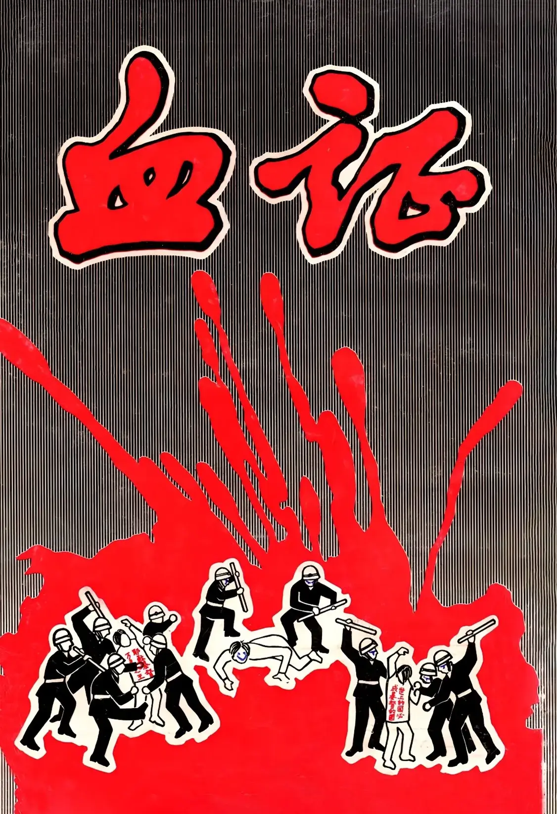

# 血証
{ width="100" }
基督靈恩佈道團. (1986). *血証*.

**前　言** 11

**一、第一批南洋朝聖團抵台** 11

**二、以法蓮山地** 41

1. 雲柱停在嘉義——以法蓮山地 41
1. 以法蓮山上守望者的呼叫 51
1. 在以法蓮山地指揮雅各彗星爭戰 71

**三、迎接屬靈的普珥日** 81

1. 不跪不拜 91
1. 仇人敵人就是這惡人哈曼 111

**四、國民黨暴政圍攻錫安** 141

1. 跟蹤、監視 141
1. 行政命令比憲法大？ 151
1. 他們見了這城就驚奇喪膽 161
1. 斷絕補給線 171
1. 「東柏林圍牆」重現 181
1. 正義對抗暴政 191
1. 陳列基督身體的見證 201

**五、國民黨在桃園國際機場的瘋狂大暴力** 211

1. 台北教會獻殿 211
1. 桃園國際機場接機 231
1. 願流我們血的罪歸到蔣家王朝 301
1. 舉世無雙的暴力驅逐 371

**六、南洋朝聖團被趕散到香港揭發國民黨暴政** 421

**七、南洋朝聖團被押回大馬揭發國民黨暴政** 491

1. 國民黨政權形同不法匪幫 491
1. 國民黨必掉在神為他張開的網羅中 531
1. 以東成為最弱小的國家 561

**八、南洋朝聖團在新加坡揭發國民黨暴政** 581

**九、新約教會近代史——末世血證史** 621

1. 一粒麥子落地死，結出許多子粒來 621
1. 純正的殉道血脈 631
1. 歡度普珥 651
1. 空前的患難，空前的復興 661
1. 新約教會的神對國民黨公義的判斷 681

**在火中榮耀我神** 701
