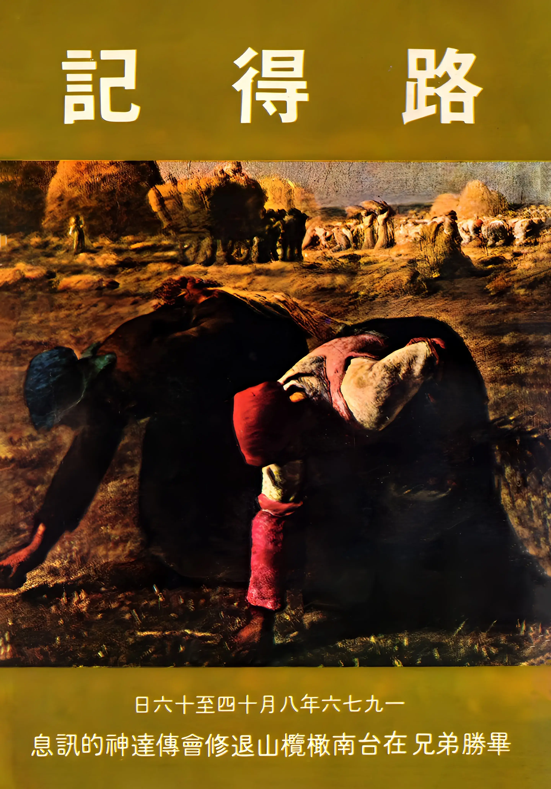

# 路得記
{ width="100" }
畢勝. (1976). *路得記*.

**序 言** 1

**路得記第一講——歸回聖地** 1

1. 士師秉政，國中饑荒 1
1. 神的百姓，走向摩押 2
1. 外邦道路，悲慘結局 4
1. 耶和華眷顧自己的百姓 6
1. 兩種不同的歸回 7
1. 同心同行，歸回聖地 22

**路得記第二講——不要離開這裡** 25

1. 波阿斯的富有 26
1. 路得拾穗 27
1. 不要離開這裡 34
1. 波阿斯的祝福與耶和華的賞賜 44
1. 路得的聖別生活 46

**路得記第三講——無止境的奉獻與更深的死** 49

1. 無止境的奉獻 49
1. 更深的死 51
1. 活祭 53
1. 末後的恩比先前的恩更大 57
1. 那人今日不辦成這事必不休息 60

**路得記第四講——與主聯合承受產業** 62

1. 波阿斯為路得贖以利米勒之地 62
1. 波阿斯娶路得為妻 66
1. 長老的祝福 67
1. 國度由她而立，君王由她而出 68
 