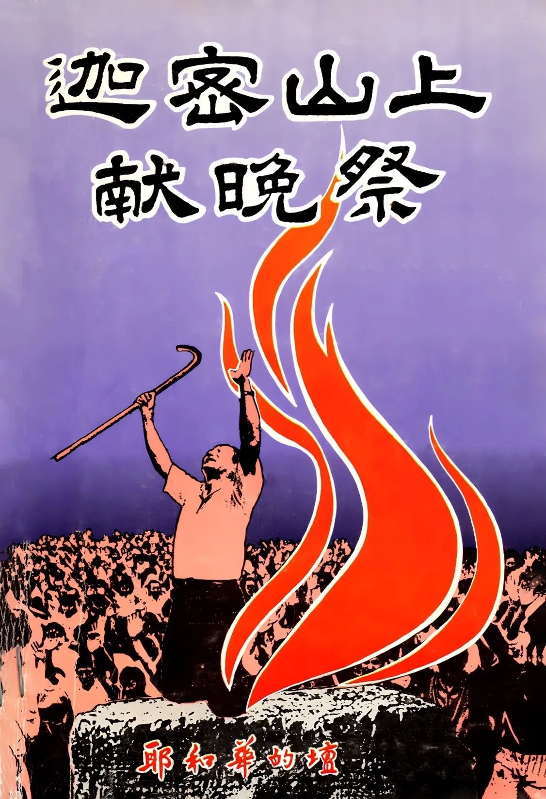

# 迦密山上獻晚祭
{ width="100" }
基督靈恩佈道團. (1991). *迦密山上獻晚祭*

**序 言** 1

* 今日迦密山戰役 3
* 盡末後以利亞職事 2
* 近前來獻晚祭 4
* 洪弟兄迎戰野驢 7
* 義無反顧的獻晚祭 7
* 迎戰以實瑪利野驢政權 11
* 我們死得起，馬哈迪政權賠不起 14
* 末後以利亞給勇士們的信 16
* 馬來西亞信仰大迫害 18
* 至高神論以東打中了野驢要害 20
* 傾倒性命的禁食禱告 22
* 倒水獻晚祭的禁食禱告 25
* 彗星出擊 34
* 耶和華神降火顯應 35
* 如羊羔被牽到宰殺之地 37
* 新約教會永不被滅 38
* 神要全面性毀滅馬哈迪野驢政權 39
* 神奪回王印交給末底改 41
* 新約教會始而得勝 終必得勝 43
* 越洋聯線盛會 45
* 繼續前進，徹底趕出野驢 63
* 大馬野驢必在驚慌中被趕下坑 64

**信 息** 66

* 有權能的獻晚祭 67
* 義無反顧的獻晚祭 71
* 馨香的祭物 77 
* 打碎大山 夷平小坡 81
* 祭壇、祭牲、天火 87
* 十架不歸路 93
* 重演以斯帖記 95
* 今日的以斯帖記 99
* 曝光死 99
* 新約教會重演以斯帖記 101
* 野驢顯身 滅亡日近 105
* 帶著耶穌的死 108
* 活祭與權能 113
* 持定猶太人的特性 118

**見 証** 125

* 使亞哈得見以利亞 126
    * 義無反顧獻上晚祭 佘玉璽弟兄 133
    * 靠主恩制勝仇敵 嚴家漢弟兄 138
    * 因信而神勇 梁信勇弟兄 140
    * 澆奠的祭牲 鄭莉莉姊妹 142
    * 我也有分於以東之役 周經年姊妹 145
    * 走上十架血路 黃麗芳姊妹 146
    * 面向鬥獸場而去 陳梅芳姊妹 148
    * 世界在背後，十架在前頭 梁麗燕姊妹 151
    * 昂首挺胸，大公無畏 陳淑君姊妹 153
* 頂天立地的活祭牲 156
    * 與時代器皿同獻晚祭 陳月玲姊妹 163
    * 沒有前途，只有神旨 末底改弟兄 169
    * 世界最厭棄的角落是我樂園 吳月清姊妹 173
    * 與骨肉至親同生死、共患難  李東林弟兄 175
    * 將身體獻上當作活祭 王恩慈弟兄 176
    * 將自己置於死地而後生 梁安弟兄 177
    * 天火焚燒祭牲 陳裕泉弟兄 179
    * 傾上性命在所不惜 薛以愛姊妹 180
    * 堅持真理，戰勝強權 王愛萍姊妹< 182
    * 奉差遣往人國黑牢見証神的尊榮 吳貴榮弟兄 185
    * 信耶和華就立穩，信祂的先知就亨通 薛成竹弟兄 188
    * 主捨命大愛溶化了我 賴梅枝姊妹 189
    * 信神所差來的，就作成神的工 林錫林弟兄 191
    * 在火窯中榮耀神 陳展昭弟兄 192
    * 無止境地獻上 王淑貞姊妹 196
    * 上迦密山與末後以利亞同獻晚祭 林介中弟兄 198
    * 我成了為基督被囚的使者 周光成弟兄 199
    * 因信趕出女奴母子 周光心姊妹 200
    * 以利亞的神使我戰勝仇敵 周光惜姊妹 203
    * 信實的神必為我審判以東 黃麗恩姊妹 205
    * 我們的歌聲要殺死暴君 黃力靈姊妹 207
