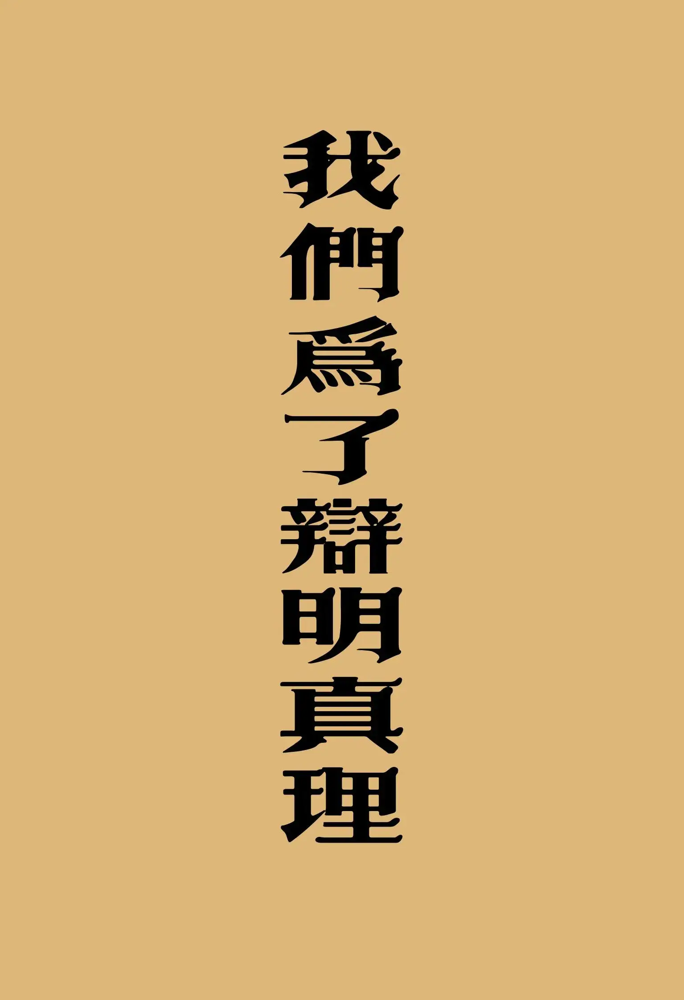

# 我們為了辯明真理
{ width="100" }
江端儀. (2003). *我們為了辯明真理*

**一、我們為了辯明真理「引言」** 3

* 江端儀姊妹答覆鄭、吳弟兄的來信 8
    * 江姊妹給鄭老弟兄的信 8
    * 鄭老弟兄兒子的來信 15
    * 江姊妹致鄭老弟兄兒子的信 16
    * 鄭老弟兄來信之一 23
    * 是評今日方言呢？抑破壞他人名譽？ 24
    * 鄭老弟兄來信之二 28
    * 江姊妹覆鄭老弟兄及莊姊妹來信之一 29
    * 鄭老弟兄來信之三 46
    * 江姊妹覆鄭老弟兄的信之二 49
    * 鄭老弟兄來信之四 63
    * 江姊妹覆鄭老弟兄的信之三 64
    * 江姊妹覆「星加坡教會」吳弟兄的信 69
    * 江姊妹覆鄭老弟兄的信之四 77
    * 江姊妹覆星加坡吳弟兄等四人聯合公開信 83
* 衛道書信 108
    1. 有火一般的驚人試煉要臨到我們 108
    1. 神為新約教會設立了基督靈恩佈道團 115
    1. 有人起來說悖謬的話 124
    1. 有人擅用新約教會名義分發荒謬的言論 130

**二、「我們為了辯明真理」之續篇** 135

**三、駁斥吳恩溥所寫之謬論的公開信** 161

1. 指出吳恩溥所寫之
「評今日的方言運動」等說的謬論 161
1. 駁斥吳恩溥所寫
「關於江端儀及其重建新約教會」單張之謬論 166
