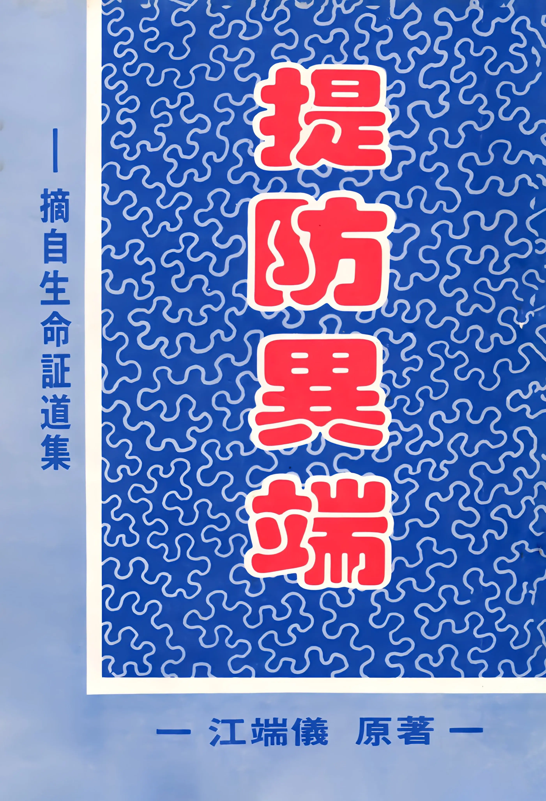

# 提防異端
{ width="100" }
江端儀. (1984). *提防異端* (摘自[*生命證道集*](生命證道集.md)).

**提防異端之一**  1

* 前　言 1
<!-- -->
1. 天主教（又名羅馬教） 4

    ???+ abstract "天主教（又名羅馬教）"
        1. 教皇作元首
        1. 不提倡教徒讀聖經
        1. 向教皇神父告解認罪
        1. 馬利亞作中保
        1. 拜偶像拜聖物
        1. 煉獄
        1. 贖罪票
        1. 禁止嫁娶和禁戒食物
        1. 洗禮和領聖體

1. 摩門教（又名耶穌基督末世聖徒教會） 15

    ???+ abstract "摩門教（又名耶穌基督末世聖徒教會）"
        1. 論聖父
        1. 論聖子
        1. 論聖靈

1. 安息日會（又名基督復臨安息日會） 19

    ???+ abstract "安息日會（又名基督復臨安息日會）"
        1. 不信靈魂永存
        1. 注重律法過於生命
        1. 妄測主來日子

1. 守望台（又名耶和華見證人） 29

    ???+ abstract "守望台（又名耶和華見證人）"
        1. 不信聖經
        1. 不信主耶穌是神的兒子
        1. 不信惡人受永刑
        1. 不信寶血救贖
        1. 妄測基督已再來

**提防異端之二** 34

* 基督教新神學派所傳的「社會福音」是假福音 34

    ???+ abstract "社會福音"
        1. 否認聖經權威與神蹟
        1. 貶低基督的位格
        1. 否認救贖真道
        1. 否認童女生子、基督復活、末日審判
        1. 否認基督必再來  

    ???+ abstract "新神學派"      
        1. 屬世的組織
        1. 不法的活動

**提防異端之三（增補）** 57

* 真耶穌教會的錯謬信仰 57

    ???+ abstract "真耶穌教會"
        1. 忽略了靠主寶血赦罪
        1. 受浸時要仆倒（面向下）
        1. 必須守舊約聖安息日
        1. 受水浸與靈浸才是得救重生
        1. 嬰孩受浸就算為得救
        1. 受靈浸說方言外、加上身體一定震動為憑據
        1. 只有真耶穌教會才是聖靈建立的真教會

**最後的結論** 71
