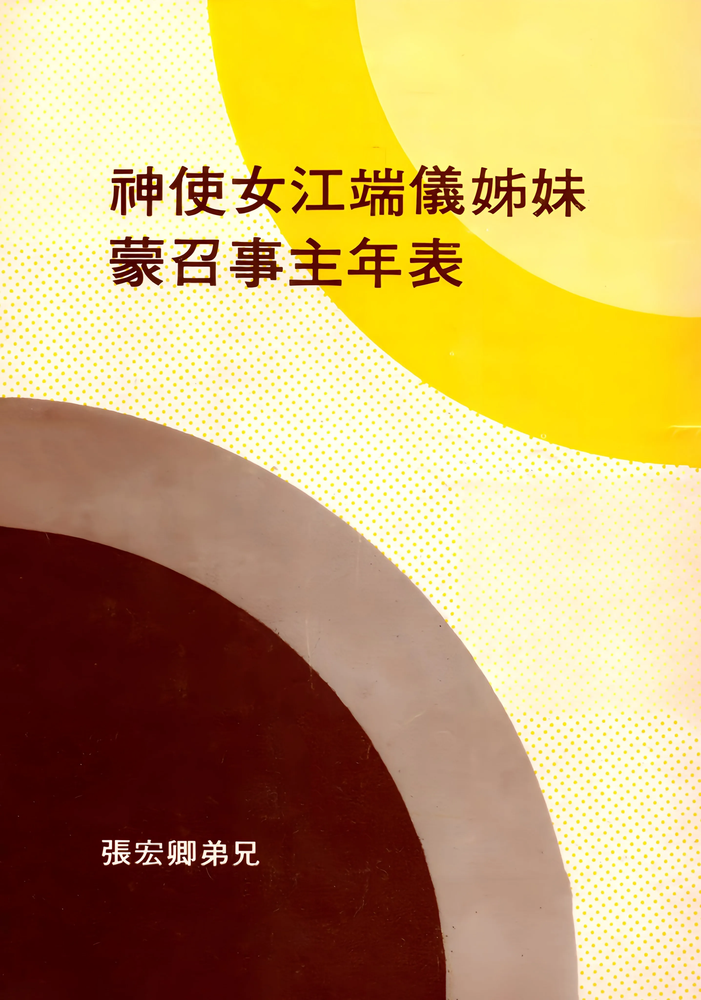

# 神使女江端儀姊妹蒙召事主年表
{ width="100" }
張宏卿. (1979). *神使女江端儀姊妹蒙召事主年表*

| 年 | 月 | 日 | 地點 | 生命經歷 | 說明 |
| --- | --- | --- | --- | --- | --- |
| 1923 | | | 廣東 | 誕生 | 時在當年秋天。（見[生命證道集](生命證道集.md)下集187頁） |
| 1930 | | | 上海某禮拜堂 | 受滴水禮 （由母親帶領）。 | 時年七歲，係滴水禮，掛名而已。（見[生命證道集](生命證道集.md)下集190及318頁） |
| 1957 | | | 香港 | △悔改重生（諸病得醫治） 按江姊妹重生後，滿有忌邪的心。首先在家中作了聖別潔淨的工作。同時生活大有改變，喜愛讀經、禱告、作見證、傳福音，甚至奉獻服事，並讀聖經夜校。只是仍一面在拍電影，腳踏兩隻船。 | 時在該年底，一日宿疾胃病復發，且潰瘍出血，突覺臨近死門（這以前曾自殺兩次未果），方真的想到死後何往？如果經上所說天堂地獄是真的，豈不當早作抉擇？便自卑主前，蒙聖靈光照，茅塞頓開，知自己滿身罪污和不義，即在病榻多日流淚痛悔認罪，蒙了拯救。（見[生命證道集](生命證道集.md)下集197至198，201至212頁） |
| 1959 | 3 | | 香港 | 購屋奉獻 （三月買定，五月遷入） | 即梭椏道七號六樓。五月遷入，每拜四奉主名舉行家庭聚會。從此一步步在主的帶領下走上事奉的路。（見[生命證道集](生命證道集.md)下集224至226頁） |
| 1959 | 9 | | 香港 | △蒙召（經過二步驟）<ol><li>與世界一刀兩斷——藉演跳海，訣別影壇（時為九月廿一日）</li><li>走信心的路——順服神旨，撕去所有股分單、借據、保險單等等屬世倚靠。</li></ol> | 此時主感動澳門✕✕會一位長老和牧師寫給她的聯名信，是用愛心說的誠實話，她接信後，一面大得激勵（因她已在多處作過見證頗受歡迎），一面心中仍有厲害的爭戰。正想尋求幫助，恰巧她素來所敬愛的×老弟兄來訪，稱係受感奉差而來，且聲言從未探訪過人，使她喜出望外。（見[生命證道集](生命證道集.md)下集213至216，218至220頁） |
| 1960 | 2 | | 香港 | 主為她開了傳道之門，港九各公會宗派紛請領會。 | 在這以前，她只有家庭聚會及個人街頭、醫院等福音工作。自一九六○年二月起，應邀到港九各公會宗派禮拜堂講道，主藉一位外國牧師的信提醒她，勿用高言大智的話，只當傳講主耶穌寶血赦罪真理。（見[生命證道集](生命證道集.md)下集226至227頁） |
| 1961 | 7 | 10 | 香港 | △受靈浸（數日後看到異象，聽到聲音）<ol><li>異象——白色十字架閃閃發光，一連三次現在牆上。</li><li>聲音——親愛的女兒！妳願意背起十架跟隨我走窄路嗎？我要尋找一人在這末世作我的口，傳出人所不歡迎的真道，妳願意為我的道忍受諸般的凌辱與苦難嗎？但是女兒啊！妳不要忘記這十架的背後是榮耀的冠冕！妳願意傳講我榮耀的聖道，在我面前為這國站在破口防堵嗎？</li></ol> | 這是她經過多時多次的追求於當天晚間忽然得著的，即時說出簡單的舌音。 在此以前，她只知道傳揚救恩，此後主將傳講血、水、聖靈全備福音的時代真理的重責大任託付了她。<ol><li>因著所看見的異象（在她屋內牆上）是那樣明亮，所聽見的聲音又是那樣清楚，她更被主愛激勵，跪在主前飲泣失聲，既懼且喜</li><li>從此她便日夕用靈禱進入與主親蜜靈交的生活中。（以上詳見[生命證道集](生命證道集.md)下集300至301，316及318頁）</li></ol> |
| 1961 | 7 | 21 | 九龍新界海灘 | △受水浸（在榮耀的7.21）<ol><li>七月十日受靈浸。</li><li>七月中旬見異象聽主聲。</li><li>七月廿一日受水浸。</li></ol> | 水浸是受靈浸後的祈求，為要活出合主旨的見證（因她以往受的是滴水禮，不合經訓），這次是一位被聖靈充滿的神僕給施浸的。至此主應驗了二年前（一九五九、七）在她身上成就大事的應許。（見[生命證道集](生命證道集.md)下集319頁） |
| 1962 | 5 | 1 | 香港 | △奉命進入密室 二百多天禁食祈禱，寫[生命證道集](生命證道集.md)（按於一九六三年四月二日完稿，五月十日出書問世）。 | 這是主在同年二月廿六日午夜啟示她的，此時正是對外應邀證道最忙碌之際，幾至應接不暇，主卻要她停下來，且在未脫稿前，不得外出做工。（見[生命證道集](生命證道集.md)下集323頁329至342頁及[聖靈行傳上集](聖靈行傳（上）.md)4及13頁） |
| 1963 | 1 | 中旬某日 | 香港 | △預言將奉差遣 萬軍之耶和華如此說：「今年四月十八日我要在你們中間行極奇妙的大事，我要差派他們從梭椏道七號六樓出發作工，我要賜福你們的工作，並與你們同在。事先必有預兆使你們知道我是特別選召你們，差遣你們去傳我完備的聖道。」（見[聖靈行傳上集](聖靈行傳（上）.md)2至3頁） | 這是主藉一位林弟兄在他們的聚會中一連兩次發出的預言，林弟兄也在各處的聚會中發出同樣預言，有人認為他是憑己意說的，但後來證明真是出於神。按此一時期，梭椏道七號六樓的聚會相當復興，而早禱會更為榮耀。（見[聖靈行傳上集](聖靈行傳（上）.md)2至3頁） |
| 1963（第一個4.18） | 4 | 18 | 香港 | △職事的宣告 T老弟兄當眾發預言，江姊妹及同工們要受膏奉差作特殊聖工，震動東方和西方，神要行作大事。 一日在跪禱中主啟示她，今年有三個四月十八日，主都要作大事在她身上。 | 這是主特遣的西方一位老僕人T老弟兄，先在異象中認識了江姊妹，然後到東方來，在上海禮拜堂，於四月十七日晚宣告的。當時並邀請他們（江、張、范、洪）一同服事，直到翌晨二時，正是四月十八日。（見[聖靈行傳上集](聖靈行傳（上）.md)5至7頁） |
| 1963（第二個4.18） | 5 | 11 | 香港 | 奉差遣在港九傳講「血、水、聖靈」全備真道 | 這是生命證道集出書的次日，即奉差恢復在港九各禮拜堂傳講血、水、聖靈全備真道，為時近一個月，無一日空閒。（見[聖靈行傳上集](聖靈行傳（上）.md)13頁） |
| 1963（第二個4.18） | 6 | 10 | 星加坡 | △奉差率基督靈恩佈道團離港乘機飛往星馬，次晚再遇T老弟兄當眾發預言：神要賜福星馬的人，聖靈特遣祂的使女和佈道團來此作工，雖然他們面前的工作非常艱巨，也有極大的逼迫和患難在等著他們，但神與他們同在，要大大彰顯祂的榮耀，並用神蹟奇事百般異能、聖靈恩賜隨著他們。 | 這是第三個四月十八（舊曆閏四月），至此主應驗了祂的話。 到星後的次日晚上，即展開為時半年的佈道工作。（見[聖靈行傳上冊](聖靈行傳（上）.md)全） 首日晚上在恩典堂，聚會之先T老弟兄忽然出現！便當眾預言。並應驗第一個四月十八日在香港上海禮拜堂曾對江姊妹說，在地上還要見一次面的話。（見[聖靈行傳上集](聖靈行傳（上）.md)19頁） |
| 1963 | 7 | 21 | 香港 星加坡 | 香港教會正式成立，（首次擘餅記念主）。同時江姊妹與同工們在星大量焚毀偶像及可憎之物。（見[聖靈行傳上集](聖靈行傳（上）.md)46頁） | 先是七月十四日有位西國傳道人（多牧師）自動到梭椏道七號六樓當眾宣告說：「神要賜福此地，在此建立新約教會，下主日應有擘餅記念。」（見[聖靈行傳下集](聖靈行傳（下）.md)252頁） |
| 1963 | 11 | 18 | 居鑾 | △七．二一默示全然顯明 聖靈要重建榮耀新約教會。（[該二：1／9](https://www.bible.com/zh-TW/bible/46/HAG.2.1-9)） （參[聖靈行傳下集](聖靈行傳（下）.md)二十卷全） | 先是在數月前主即多方用人事物啟示她關乎7.21的事：<ol><li>吩咐在單張上印上7.21</li><li>赴星班機號碼是7.21</li><li>一位林弟兄曾向她預言7.21默示</li><li>香港教會於7.21成立……。但一直不甚清楚。此日清晨讀到[哈該二：1](https://www.bible.com/zh-TW/bible/46/HAG.2.1)，茅塞頓開，十分希奇！至此始了然神的託付正是耶利米的職事，是拔出、拆毀、毀壞、傾覆又栽植、建立的工作。</li></ol> |
| 1963（六個月） | 6 - 12 | 10 - 14 | 星馬各地 | 江姊妹率基督靈恩佈道團在星馬各地六個月作神所要他們作的大工，經歷各種靈戰，使無數罪人領受血、水、聖靈全備救恩。聖靈一步步引領並啟迪神更高心意，要重建榮耀新約教會。並在最後階段，聖靈藉她建立星加坡、吉隆坡、怡保、檳城、實兆遠、巴里文打、居鑾、永平、新山十處教會。在新山某日，神以天上圓形的彩虹繞日出現。江姊妹在神的異象中，靈被聖靈舉起，深感此是神與祂使女立下慈愛誠實的約，……得以在諸般逼迫試煉患難爭戰中作完祂末世所託的大工。（見[聖靈行傳上集](聖靈行傳（上）.md)190頁） | <ol><li>星加坡五十五天帳棚露天大佈道奇蹟。</li><li>吉隆坡聖靈施行了奇妙大作為。</li><li>怡保第一次佈道，聖靈作了「聖靈行傳」預備的工。</li><li>檳城遭遇一場極大靈界爭奪戰。</li><li>實兆遠神成就奇異的工。</li><li>第二次到怡保，神建立羊圈——新約教會（異象應驗）。</li><li>從撒但手中奪回來的巴里文打教會。</li><li>二次回檳城招聚羊群，神賜新名「檳城教會」。</li><li>三次到怡保，神已成就大事。</li><li>重返吉隆坡，神招聚祂兒女流歸施恩之地。</li><li>居鑾坡衝破重重難關，建立教會</li><li>永平教會在兩小時內被聖靈建立的大奇蹟。</li><li>新山建立羊群高台及聖靈所顯示的異象。</li><li>星加坡教會在爭戰中被建立，神旨得成。（見[聖靈行傳上集](聖靈行傳（上）.md)第二卷至十五卷）</li></ol> |
| 1963 | 12 | 14 | 香港 | 從星馬回香港 | 六個月前，主親領她們到星馬作成祂的工，如今主又親領她們回到香港。（見[聖靈行傳下集](聖靈行傳（下）.md)一頁） |
| 1964 | 1 | | 香港 | 「香港教會」豎起牌子 | 為了正名—外面的見證（見[聖靈行傳下集](聖靈行傳（下）.md)18頁） |
| 1964 | 7 | 14 | 香港 | 從被擄之地歸回原地，同過住棚節。（經歷七個月大靈戰） | 這是自一九六三年十二月十四日回港經過七個月的大靈戰勝利的歸回梭椏道七號六樓，象徵新約教會末後雖經艱難，終必得勝；特別是江姊妹在此一過程中留下的榜樣——一種可歌可泣的模式。（見[聖靈行傳下集](聖靈行傳（下）.md)十六卷全） |
| 1964 | 10 | | 香港 | 得聖靈啟示一九六六年將有復興的流從東方（台灣）神所建立之新約教會流出。 | 「七．二一聖靈重建新約教會」之真理啟示必要在一九六六年廣泛被傳開，從東方到西方，直到地極萬邦 「註」：復興乃指聖靈重建新約教會，恢復「血、水、聖靈」全備真理。（見[聖靈行傳下集](聖靈行傳（下）.md)116頁271頁）。 |
| 1964 | 11 | 5 | 香港 | 蒙神啟示發出預言信，新約教會境界必擴充。 | 不久雙溪大年、古晉等教會相繼被建立。（見[聖靈行傳下集](聖靈行傳（下）.md)271頁） |
| 1965 | 1 | 1 | 香港 | 聖靈印證神使女江姊妹及基督靈恩佈道團職事 | 即傳揚血、水、聖靈重建新約教會的職事，這是該日聚會中聖靈藉繙方言啟示的。（見[聖靈行傳下集](聖靈行傳（下）.md)第138頁） |
| 1965 | 7 | 14 | 香港 | <ol><li>七月十四日鄰屋買成</li><li>七月廿一日拆牆</li><li>農曆七．二一同工交通聚會中帶出九．二四恩言。</li></ol> | <ol><li>見證神賜我們加倍的產業。</li><li>象徵宗派的牆被拆通，神家兒女在真理聖靈裡合一。</li><li>宣告九月廿四日詩巫、台灣各地教會要被建立。（見[聖靈行傳下集](聖靈行傳（下）.md)85頁168至172頁、272頁）</li></ol>
| 1965 | 12 | 7 | 台灣 | 由港飛台（停留七日）<ol><li>堅固眾教會</li><li>按立工人職事</li><ol>（見[聖靈行傳下集](聖靈行傳（下）.md)十九卷全） | 來去均依主啟示。此時她舌痛已十分嚴重不能出聲，多日聚會由范某代讀以斯帖記信息，她坐在旁邊禱告，聖靈大大作工，其餘交通均用筆代，解決了眾教會許多難處。在聚會中和來去途中均有鮮血滴在台灣土地上。十二月十四日（普珥日）傍晚，在凱歌中飛返香港。 |
| 1966 | 1 | 15 | 香港 | 在極疼痛的大爭戰中寫成[進神的國](進神的國.md)一書。 | 十二月十四日晚江姊妹由台返港後，受撒但利害攻擊，痛苦無法入睡，靠神加力，一直在大爭戰中，躺在床上寫成此書及許多文字信件。（見[聖靈行傳下集](聖靈行傳（下）.md)223頁及[進神的國](進神的國.md)序言） |
| 1966 | 2 | 7 | 香港 | 在極度疼痛、極度衰弱中迅速寫成[聖靈行傳下集](聖靈行傳（下）.md)最後三卷（十八至二十卷） | 一月十九日江姊妹舌部傷口大血管爆裂大量流血，性命幾乎不保，但她當時心中仍念念不忘神託她寫的這三卷書，蒙主保存性命，用了十多天時間迅速寫成。（見[聖靈行傳下集](聖靈行傳（下）.md)序言） |
| 1966 | 8 | 17 | 香港 | 安睡主懷 | 於午後一時離世。計蒙召事主整整七年，安葬於和合石墳場。 |
