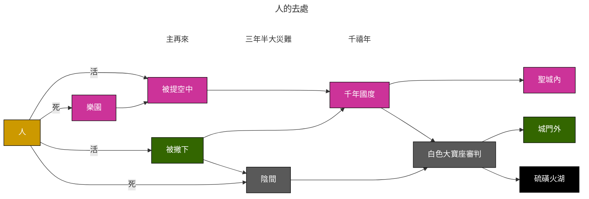

# 進神的國
{ width="100" }
江端儀. (2002). *進神的國*

**序 言** 2

**序 言（再版）** 4

**被澆奠的生命** 7

**進神的國（第一講）** 10

**進神的國（第二講）** 31

**進神的國（第三講）** 60

**進神的國（第四講）** 83

``` mermaid
---
title: 人的去處
---
graph LR
  X:::invisible ~~~~ 主再來:::noShape ~~~ 三年半大災難:::noShape ~~~ 千禧年:::noShape
  A[人]:::yellow -->|活| B[被提空中]:::pink ---> C[千年國度]:::pink ---> D[聖城內]:::pink;
  A -->|活| E[被撇下]:::green;
  E ---> C;
  E --> H;
  A -->|死| G[樂園]:::pink --> B;
  A -->|死| H["陰間"]:::gray;
  C --> I[白色大寶座審判]:::gray;
  H --> I;
  I --> F[城門外]:::green;
  I --> J[硫磺火湖]:::black;
  classDef invisible visibility:hidden;
  classDef noShape fill:none,stroke:none;
  classDef yellow fill:#cc9900, color:#fff, stroke:#000;
  classDef pink fill:#cc3399, color:#fff, stroke:#000;
  classDef green fill:#336600, color:#fff, stroke:#000;
  classDef gray fill:#595959, color:#fff, stroke:#000;
  classDef black fill:#000000, color:#fff, stroke:#000;
```
