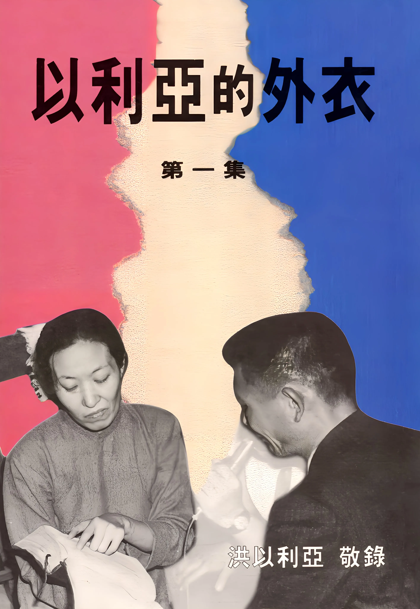

# 以利亞的外衣（一）
{ width="100" }
洪以利亞.(1996). *以利亞的外衣（一）*

**以利亞的外衣** 1

**殿的法則** 10

**先知的靈就是殉道者的靈** 15

**你們今天所看見的埃及人必永遠不再看見** 22

**霎時間降下大雨** 26

**禁食禱告** 30

**住棚節的實際** 40

**無偽的信心** 53

**五旬節聖靈降臨（復興）與屬靈職事團（十二使徒）** 61

**耶穌的死** 69

**毀滅的風** 79

**從耶路撒冷直到地極的見證人** 101
