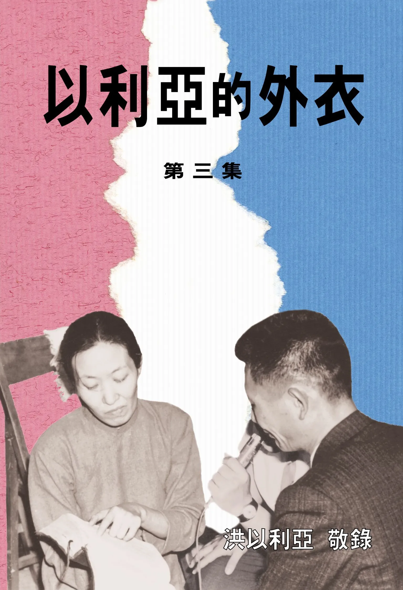

# 以利亞的外衣（三）
{ width="100" }
洪以利亞. (2005). *以利亞的外衣（三）*.

**使徒職分的恢復（一）** 1

**使徒職分的恢復（二）**8

**挖井** 13

**接棒者** 19

**神的家──雅各的異象** 26

**7﹒21的默示──神與我們立約** 32

**如何承受神所應許的** 40

**輥去埃及的羞辱** 44

**守望的孤雁** 48

**貴重的器皿** 54

**天上的國民** 63

**震動性的職事** 71

**震動性的傳揚** 80

**認識時代器皿的重要性** 85

**福音的權能──使徒行傳十四章** 93

**我們正按著那道（他們所稱為異端的道）事奉我們的神** 97

**從震動到終點** 107

**作長老、執事的條件** 113

**我已派你們作列國的先知** 127

**幸福泉源在錫安** 131

**聖靈水流** 136

**憑真實將公理傳開** 150
