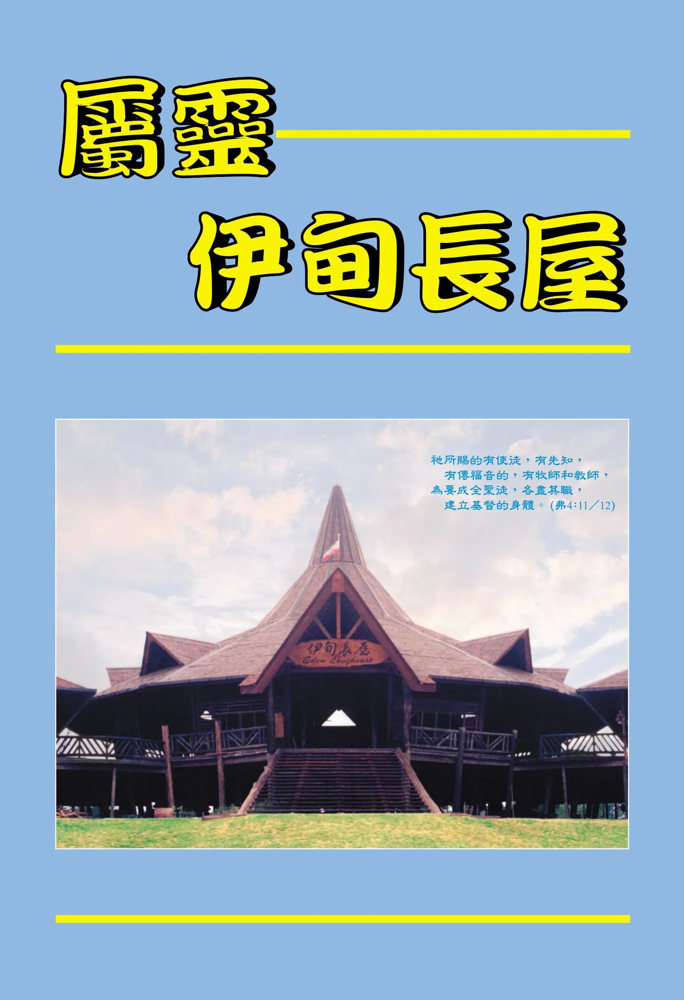

# 屬靈伊甸長屋
{ width="100" }
洪以利亞. (2004). *屬靈伊甸長屋*.

* 序　言 1

**生命的建造** 1

* 效法亞伯拉罕獻以撒 2
* 消失在整體裡 6
* 合乎主用的貴重器皿 11
* 被建造在整體裡 17
* 終日被殺 23
* 作個肯說真話 又肯聽真話的人 26
* 阿們神 30
* 暗中向主盡忠 34
* 認識在環境中的神 39
* 在應許之地客旅寄居 43
* 接受主愛的苦虐 49
* 全房如何聯絡得合式 53
* 在交通的靈裡來堅持原則 59
* 不求患難減少 乃求恩典加多 64
* 不自殺也不殺人乃甘心被殺 69
* 如水被倒出來 76

**愛裡的交通** 82

* 生命的律法 83
* 勿作不能講、不能摸的人 97
* 帳棚與祭壇 111
* 認定交通中心 125
* 我們生活工作事奉的始終與經過──神 141
* 聖徒婚姻 159
* 聖潔生活 175
* 持定對主新鮮的愛情 187
 