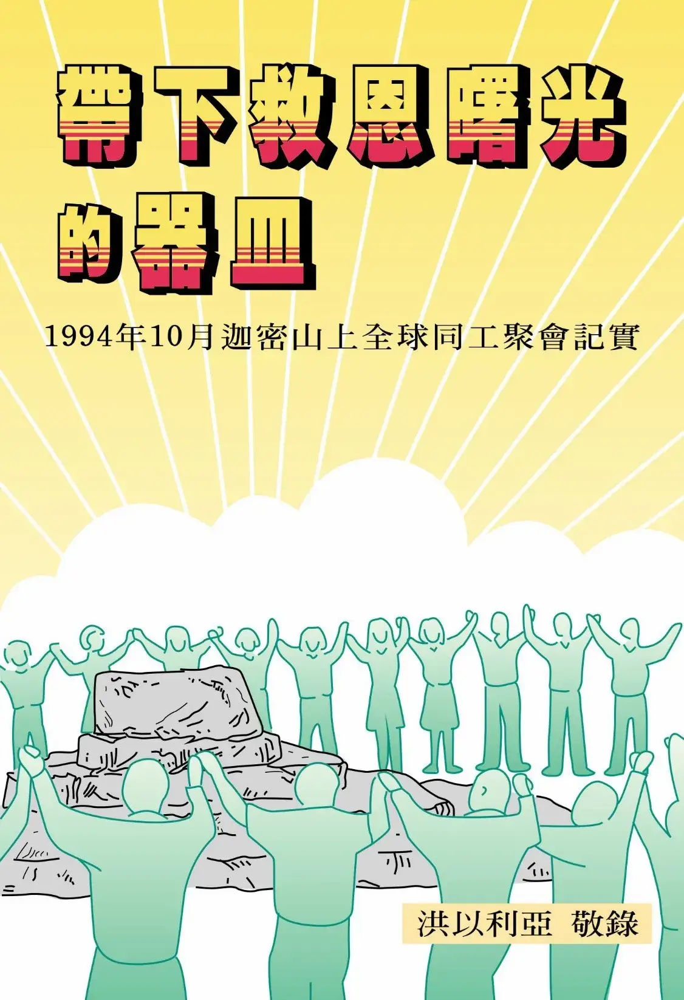

# 帶下救恩曙光的器皿
{ width="100" }
洪以利亞. (2004). *帶下救恩曙光的器皿*

**序 言** 1

**基督靈恩佈道團  錫安支嶺巡禮** 1

* 基督靈恩佈道團希伯崙巡禮 2
* 基督靈恩佈道團迦密山巡禮 12
* 迦密山全球同工聚會 19
* 基督靈恩佈道團伯特利巡禮 32
* 基督靈恩佈道團摩利亞山巡禮 38
* 基督靈恩佈道團伯大尼巡禮 45
* 基督靈恩佈道團伯利恆巡禮 48
* 回伊甸進入榮耀享安息 50

**今日馬可樓上的 整頓與裝備
〈全方位大復興器皿的特性〉** 55

* 認識主的愛，經歷主的恩 56
* 真實的奉獻者 69
* 帶進救恩曙光的約瑟、馬利亞 76
* 引進救恩曙光的施浸約翰 87
* 身體的建造 98
* 肢體配搭的奧秘 112
* 摸著神憐憫心腸的器皿 121
* 馬可樓上的整頓 136
* 在雅博渡口經歷毗努伊勒 147
* 真理問答 151 
