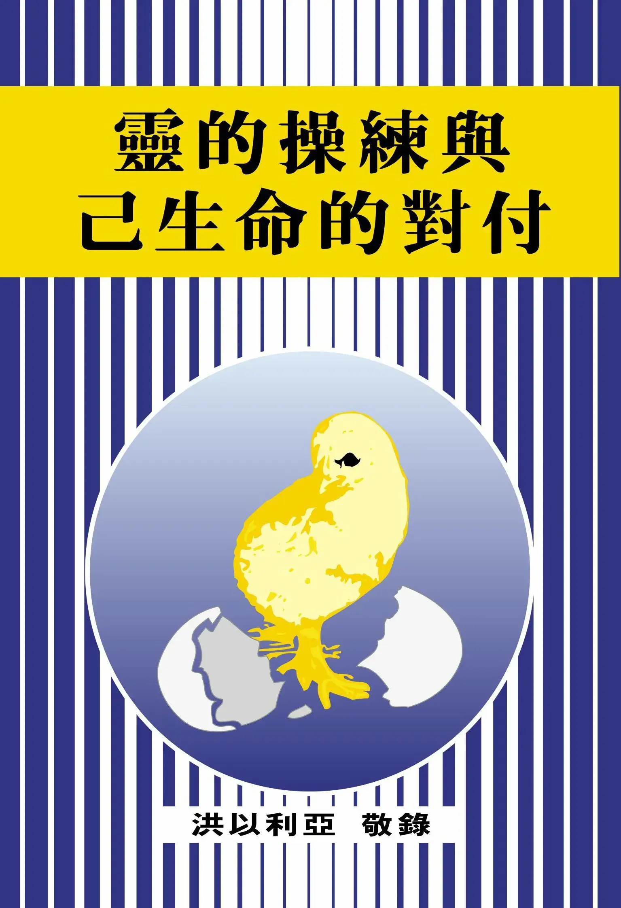

# 靈的操練和己生命的對付
{ width="100" }
洪以利亞. (2004). *靈的操練和己生命的對付*

**目 錄** 

**序　言** 1 

**第一篇　靈的認識──靈的重要性** 1 

1. 人的靈統管全人 1 
1. 人的靈是耶和華的燈 4 
1. 人的靈是敬拜神的機構 6 
1. 人的靈知道人的事 8 
1. 人的靈是神衡量人的準則 10 

**第二篇　靈的操練** 18

1. 使用靈 18 
1. 對付靈 25 
1. 如何使用靈 37 
1. 破碎前與破碎後 45 

**第三篇　純正的靈** 58 

1. 虛心的靈 59 
1. 正直的靈 66 
1. 樂意的靈 68 
1. 剛強的靈 71 
1. 仁愛的靈 74 
1. 喜樂的靈 77 
1. 謹守的靈 79 
1. 迫切的靈 82 
1. 火熱的靈 86 
1. 公義的靈 91 
1. 忌邪的靈 95 
1. 溫柔的靈 98 
1. 安靜的靈 105 

**第四篇　己生命的認識** 108 

1. 己生命是撒但的根據地 108 
1. 己生命攔阻人走神命定的道路 111 
1. 屬魂的人不能明白屬靈的事 115 
1. 己生命與神為仇為敵 119 

**第五篇　己生命的對付** 124 

1. 對付己生命的重要性 124 
1. 如何對付己生命 131 

**第六篇　己生命的各種表現** 137 

1. 掩飾自己的過錯 137 
1. 逃避神的面光 138 
1. 講理由 139 
1. 推卸責任 140 
1. 嫉妒 141 
1. 殺人 142 
1. 愛面子 143 
1. 開比較 144 
1. 欣賞自己 145 
1. 揭人瘡疤 147 
1. 個人英雄主義 149 
1. 顯揚自己 151 
1. 貪享安逸 154 
1. 滿足現況 155 
1. 逃避現實 158 
1. 苟全性命 160 
1. 見風轉舵 161 
1. 降低神的標準 162 
1. 把神的話當戲言 164 
1. 濫用感情 166 
1. 爭地盤 170 
1. 利己主義 172 
1. 唯利是圖 173 
1. 患得患失 175 
1. 假公濟私 180 
1. 以人工當神工 181 
1. 明知故問 183 
1. 老奸巨滑 184 
1. 口蜜腹劍 186 
1. 怨天尤人 187 
1. 個人恩怨 189 
1. 勢利眼 191 
1. 放肆、隨便 192 
1. 任意妄為 193 
1. 臨陣脫逃、臨危變節 194 
1. 爭寵 195 
1. 看眼前果效 197 
